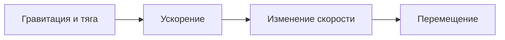

# Физика Space: понятный справочник

Space опирается на **ньютоновскую механику**: инерцию, гравитацию и передачу импульса. Орбиты получаются из этих законов. Поверх них работают игровые двигатели, автопилот и упрощённые столкновения.

Сначала — смысл законов и примеры из игры. [Подробные формулы и параметры реализации](#техническая-справка) собраны в раскрывающемся блоке в конце. Описание соответствует коду на 2026-10-09.

## Карта справочника

| Вопрос | Что его объясняет |
| --- | --- |
| Почему корабль не останавливается без двигателя? | [Инерция и законы Ньютона](#1-движение-и-законы-ньютона) |
| Почему звезда искривляет путь, а тяжёлое тело сильнее притягивает? | [Закон всемирного тяготения](#2-гравитация) |
| Почему спутник падает к планете, но не достигает поверхности? | [Орбиты и законы Кеплера](#3-орбита--это-постоянное-падение) |
| Откуда берётся скорость после столкновения? | [Импульс и неупругий удар](#4-столкновения-и-импульс) |
| Почему у звезды тело ускоряется, а далеко замедляется? | [Энергия и момент импульса](#5-энергия-и-момент-импульса) |
| Почему чёрная дыра не поглощает весь мир? | [Орбиты и приливные силы](#6-чёрные-дыры-и-приливы) |
| Почему корпус и направление движения могут различаться? | [Тяга и управление](#7-двигатель-курс-и-высота) |
| Как корабль попадает в движущуюся цель? | [Упреждение и автопилот](#8-наведение--математика-поверх-физики) |

Жирная буква в формуле означает **вектор**: величину вместе с направлением. Обычной буквой обычно записана только величина. Например, можно изменить направление скорости, сохранив её величину.

| Обозначение | Смысл |
| --- | --- |
| $m$, $M$ | Массы; в примерах $M$ обычно масса звезды или планеты |
| $r$ | Расстояние между центрами, а не высота над поверхностью |
| $\mathbf v$, $\mathbf a$ | Скорость и её изменение за единицу времени — ускорение |
| $\mathbf F$ | Сила: воздействие, меняющее движение |
| $\mathbf p$ | Импульс движения, $m\mathbf v$ |
| $K$, $U$, $E$ | Кинетическая, потенциальная и суммарная механическая энергия |
| $G$ | Гравитационная постоянная; в игре задана во внутренних единицах |

## 1. Движение и законы Ньютона

**Первый закон — инерция.** Если сумма сил равна нулю, тело сохраняет скорость и направление. Чтобы продолжать лететь, постоянно работающий двигатель не нужен. В быту предметы останавливает трение; в нашей космической модели такого торможения нет. Но возле звезды «двигатель выключен» не означает «сил нет»: гравитация продолжает менять путь. [Подробнее об инерции](https://openstax.org/books/university-physics-volume-1/pages/5-2-newtons-first-law).

**Второй закон — связь силы и ускорения:**

$$\sum\mathbf F=m\mathbf a.$$

Сила меняет **скорость**, а не сразу положение. Ускорение вперёд разгоняет, против движения тормозит, поперёк движения поворачивает траекторию. При одной и той же силе телу вдвое большей массы требуется вдвое больше времени для такого же изменения скорости. Для ракеты с меняющейся массой нужна более общая модель с учётом выброса топлива; здесь массы тел между столкновениями постоянны. [Второй закон](https://openstax.org/books/university-physics-volume-1/pages/5-3-newtons-second-law).

**Третий закон — взаимность воздействия.** Звезда притягивает планету, а планета притягивает звезду с равной по величине противоположной силой. Звезда реагирует слабее из-за большей массы. Поэтому оба тела движутся вокруг общего центра масс. Эти силы действуют на разные тела и не отменяют друг друга на каждом из них. Реальная ракета разгоняется, выбрасывая вещество назад; воздух для этого не нужен. [Третий закон](https://openstax.org/books/university-physics-volume-1/pages/5-5-newtons-third-law).

**В Space:** природные тела взаимно притягиваются. Корабли, ракеты и искусственные спутники используют приближение пробных частиц: их обратное влияние на большие тела уменьшено или отброшено. Ядро аркады закреплено. Масса корабля задаёт игровые характеристики и цену; они не выводятся строго из $F=ma$.

## 2. Гравитация

Закон всемирного тяготения для двух сферических тел снаружи их поверхностей:

$$F=G\frac{Mm}{r^2},\qquad a=\frac Fm=G\frac M{r^2}.$$

Чем больше масса источника, тем сильнее притяжение. Если расстояние увеличить вдвое, сила станет вчетверо меньше. Ускорение маленького спутника не зависит от его собственной массы: увеличившаяся сила делится на такую же увеличившуюся инертную массу. Если оба тела сравнимы по массе, заметно движутся уже оба. [Закон тяготения](https://openstax.org/books/university-physics-volume-1/pages/13-1-newtons-law-of-universal-gravitation).

Несколько источников складываются **по направлениям**. Между двумя звёздами часть воздействий может компенсироваться; сбоку они складываются в новое направление. В общем случае заранее нарисованный эллипс уже не описывает весь путь — приходится считать систему многих тел, или N-body.

**В Space:** используется сумма таких ускорений со *смягчением*. Оно сглаживает очень тесные сближения, чтобы деление на почти нулевое расстояние не разрушало расчёт. Это численное приближение, а не сила трения и не размер тела. $G=400$ относится к игровым единицам, а не к килограммам, метрам и секундам реального космоса.

## 3. Орбита — это постоянное падение

Спутник летит вбок, а притяжение всё время отклоняет его к планете. Если боковая скорость подобрана правильно, поверхность остаётся ниже его пути: спутник **не перестаёт падать**, но постоянно промахивается мимо планеты.

Для маленького спутника на круговой орбите гравитационное ускорение равно ускорению изменения направления $v^2/r$. Отсюда:

$$v_{\rm circle}=\sqrt{GM/r},\qquad T=2\pi\sqrt{r^3/(GM)}.$$

$T$ — время одного оборота. При большем радиусе скорость меньше, а путь длиннее, поэтому оборот занимает больше времени.

В идеальной двухтельной системе без смягчения действуют **три закона Кеплера**:

1. Связанные орбиты — эллипсы с общим центром масс в фокусе. У маленькой планеты вокруг массивной звезды фокус почти совпадает со звездой. Круг — частный случай.
2. Радиус-вектор заметает равные площади за равное время. Возле звезды тело идёт быстрее, вдали — медленнее.
3. Для малых спутников вокруг того же центра $T^2\propto a^3$, где $a$ — большая полуось. Удалённые планеты имеют длинный «год».

Это следствия ньютоновского тяготения, а не три дополнительные силы. Другие планеты возмущают орбиту, поэтому в системе многих тел эллипс может постепенно меняться. [Орбиты и законы Кеплера](https://openstax.org/books/university-physics-volume-1/pages/13-5-keplers-laws-of-planetary-motion).

**В Space:** помощник добавляет спутнику касательную скорость **относительно родителя**, а затем прибавляет скорость самого родителя. Это похоже на бросок мяча из движущегося поезда: скорость поезда не исчезает. Без этой прибавки спутник летящей планеты сразу отстал бы от неё.

Помощник также оставляет запас внутри *сферы Хилла* — области, где родитель может удерживать спутник вопреки соседнему массивному телу. Это оценка устойчивости, не непроницаемая граница. Солнце способно увести слишком далёкий спутник Земли; у спутника спутника запас ещё меньше.

## 4. Столкновения и импульс

Импульс $\mathbf p=m\mathbf v$ учитывает и массу, и направление движения. При коротком столкновении без существенного внешнего импульса сумма импульсов сохраняется. Если тела сливаются, новая скорость — средняя, **взвешенная по массам**:

$$\mathbf v_{\rm result}=\frac{m_1\mathbf v_1+m_2\mathbf v_2}{m_1+m_2}.$$

Например, тело массы 100 летит вправо со скоростью 20, а тело массы 25 — влево со скоростью 20. Остаток массы 125 летит вправо со скоростью **12**. Тяжёлый участник сильнее определяет результат; равные тела с противоположными равными скоростями дали бы покоящийся остаток.

Слияние — **неупругий удар**. Импульс сохраняется, но часть энергии движения становится нагревом, деформацией и разрушением. Энергия не исчезает: просто не вся остаётся механической энергией летящих тел. [Столкновения и сохранение импульса](https://openstax.org/books/university-physics-volume-1/pages/9-5-collisions-in-multiple-dimensions).

**В Space:** слияние пересчитывает массу и общую скорость. В режиме обломков часть массы остаётся в основном теле, часть вылетает симметричными парами: их добавочные импульсы взаимно компенсируются. Нагрев и реальные материалы не рассчитываются. Выброс ограничен для производительности. Искры взорвавшегося корабля — изображение, а не дополнительные массивные тела.

## 5. Энергия и момент импульса

Для маленького спутника вокруг массивного центра, без двигателя и других источников:

$$K=\tfrac12mv^2,\qquad U=-GMm/r,\qquad E=K+U.$$

$K$ — энергия движения; $U$ — энергия взаимного положения. Когда тело приближается к звезде, $U$ уменьшается, а $K$ растёт: оно ускоряется. При удалении происходит обратное. В идеальной свободной системе сохраняется их сумма. Удвоение скорости увеличивает $K$ вчетверо — поэтому быстрый удар намного энергичнее медленного.

При выбранном нуле потенциальной энергии на бесконечности $E<0$ означает связанную орбиту, $E=0$ — границу ухода, $E>0$ — несвязанную траекторию. Скорость ухода в этом приближении $v_{\rm escape}=\sqrt{2GM/r}$, то есть в $\sqrt2$ раза больше круговой. Связанное движение тоже может пересекать поверхность: отрицательная энергия не гарантирует безопасную орбиту. Это критерий идеальной пары, не гарантия ухода из сложной системы. [Энергия и скорость ухода](https://openstax.org/books/university-physics-volume-1/pages/13-3-gravitational-potential-energy-and-total-energy).

**Момент импульса** описывает движение вокруг центра. Для орбиты его величина $L=mr v_\perp$, где $v_\perp$ — поперечная к радиусу часть скорости. Центральная сила не создаёт вращающего момента относительно своего центра, поэтому $L$ сохраняется. При уменьшении $r$ поперечная скорость растёт; отсюда правило равных площадей Кеплера. Это момент орбитального движения, а не вращение корпуса вокруг собственной оси. [Сохранение момента импульса](https://openstax.org/books/university-physics-volume-1/pages/11-3-conservation-of-angular-momentum).

**В Space:** законы помогают понимать свободные орбиты. Численный расчёт даёт небольшие ошибки; двигатели, столкновения, управление и закреплённое ядро меняют баланс механической энергии. Собственное вращение природных тел и передача орбитального момента во вращение остатка при слиянии не моделируются.

## 6. Чёрные дыры и приливы

На большом расстоянии важна масса источника. Если заменить Солнце чёрной дырой **той же массы**, в ньютоновском приближении Земля продолжит прежнюю орбиту. Компактность позволяет подлететь намного ближе к центру, но не добавляет особую «засасывающую» силу издалека. [Объяснение NASA](https://science.nasa.gov/universe/black-holes/).

**Приливные силы** возникают из-за неодинакового притяжения: ближняя к дыре сторона большого тела ускоряется сильнее дальней. При тесном сближении этой разницы может хватить, чтобы разрушить тело. Приближённый размер области разрушения зависит от радиуса тела и кубического корня отношения масс, а не только от видимого кружка дыры. [NASA о близких встречах](https://science.nasa.gov/universe/10-questions-you-might-have-about-black-holes/).

**В Space:** снаружи действует смягчённая ньютоновская гравитация. Близкое протяжённое солнечное тело может быть захвачено по оценке приливного разрушения; у аппаратов и частиц остаётся контакт с игровым радиусом. Захват передаёт дыре массу и импульс. Устойчивая дальняя орбита может существовать долго.

Горизонт событий в настоящей физике требует общей теории относительности; игровой радиус дыры им не является. Превращение массивного остатка в дыру после слияний — заданное правило игры. Реальная судьба звезды зависит также от состава, давления и эволюции; одного превышения нашей игровой массы недостаточно для физического вывода.

## 7. Двигатель, курс и высота

**Куда смотрит корпус и куда летит аппарат — разные вещи.** Гравитация меняет скорость центра масс. Она сама по себе не обязана поворачивать нос вдоль новой траектории. Для разворота корпуса нужен вращающий момент; для изменения траектории — ускорение. Поэтому поворот носа на 90° не должен мгновенно стирать прежнюю скорость.

**В Space:** автоматический разворот корпуса вслед за движением и подавление бокового дрейфа — помощь пилоту. Левый стик задаёт желаемую скорость, а двигатель постепенно приближает к ней фактическую. Это игровой регулятор: положение стика не означает строго заданную физическую силу. В солнечном масштабе работающий ручной двигатель также компенсирует притяжение, иначе слабое торможение рядом со звездой не достигало бы задания.

При нулевой тяге скорость не обнуляется, двигатель не помогает поворачивать. Запрет поворота при выключенном главном двигателе — правило Space: реальный аппарат может иметь отдельные двигатели ориентации или маховики. Расход топлива в игре тоже задаётся правилом; изменение массы при сгорании и уравнение Циолковского не рассчитываются.

Правый стик задаёт крен и тангаж — угол носа вверх или вниз. Тангаж создаёт вертикальную составляющую скорости, которая накапливает высоту. Поэтому выравнивание носа не возвращает аппарат мгновенно на прежнюю высоту. Подъём увеличивает видимый размер, погружение уменьшает; это условная перспектива. Высота влияет на столкновения, но размер рисунка не меняет физический радиус. Природные тела остаются в одной плоскости: модель **2,5D**.

## 8. Наведение — математика поверх физики

Выстрел в текущее положение движущегося врага может пройти позади него. Нужна точка, где цель окажется **к моменту прилёта** снаряда. При постоянной скорости прогноз прост: $\mathbf r_{\rm future}=\mathbf r_{\rm now}+\mathbf v_{\rm target}t$. Но искривлённую гравитацией траекторию приходится прогнозировать шагами.

**В Space:** орудие строит короткий прогноз цели и ищет время, при котором снаряд и цель встретятся. Учитывает часть унаследованной скорости корабля, его высоту и перекрытие планетой. Сам выстрел движется прямолинейно без гравитации. При изменившейся после выстрела траектории врага промах возможен — это не мгновенное попадание по назначению.

Распределение целей оценивает время подлёта и разворота. Ближайший подходящий аппарат может перенять задачу; небольшой запас преимущества предотвращает постоянные переключения. Это алгоритм принятия решений, не физический закон.

Маршрут через точки — гладкая кривая, по которой навигатор задаёт движение с примерно постоянной скоростью. Уклонение и тяга корректируют полёт. Такая управляемая траектория не обязана быть кеплеровской орбитой и не обязана сохранять механическую энергию аппарата.

## 9. Как законы превращаются в кадры

Компьютер не вычисляет сразу всю будущую историю: он повторяет короткие шаги. **RK4** оценивает изменение движения в четырёх промежуточных состояниях шага. **Verlet** делит изменение скорости на два полушага вокруг перемещения. Это способы численного решения уравнений Ньютона, не новые законы природы.

В больших сценах **Барнс—Хатт** заменяет далёкую группу её общей массой в центре масс. Для далёкого наблюдателя компактная группа выглядит почти как один источник; близкие группы раскрываются на отдельные тела. Это уменьшает число вычислений ценой погрешности.

**В Space:** малые системы используют RK4, от 160 основных тел — дерево и Verlet. При тесных встречах шаг уменьшается. Для мелких солнечных спутников используется отдельный кеплеровский дрейф с внешними приливными поправками. Контакты проверяются вдоль движения за шаг, чтобы быстрый объект не проскочил сквозь другой между кадрами.

Интерполяция лишь делает изображение плавнее; физическую точность задаёт расчёт. Ускоренное время объясняет быстрые обороты искусственных спутников: низкий спутник Земли делает круг примерно за 0,0055 с симуляции. При 0,0001× это около **55 секунд наблюдения**, без изменения его физической скорости.

## Три коротких опыта в песочнице

- **Инерция:** разгоните аппарат и установите тягу в ноль. Он продолжит движение; возле массивного тела траектория будет искривляться.
- **Орбита:** добавьте спутник помощником. Измените его скорость через редактирование: новая траектория отличается от исходного кольца. Обратите внимание, что скорость родителя уже входит в скорость спутника.
- **Импульс:** в режиме слияния направьте два равных тела навстречу с близкими по величине скоростями. Остаток будет двигаться медленнее каждого участника. Сделайте одно тело тяжелее — результат сместится к его направлению. Внешняя гравитация продолжит действовать после удара.

## Техническая справка

Здесь сохранены точные формулы, численные параметры, ограничения и ссылки на исходники. Для знакомства с физическими идеями достаточно разделов выше.

Раскрыть математику и реализацию: силы, интеграторы, контакты, наведение и управление

## Гравитация и единицы

[Physics.kt](../src/app/src/main/java/com/xekep/space/sim/Physics.kt), [SolarSystem.kt](../src/app/src/main/java/com/xekep/space/sim/SolarSystem.kt).

Для объекта $i$ ускорение от всех остальных тел:

$$
\mathbf a_i=\sum_{j\ne i}Gm_j^{(g)}\frac{\mathbf r_j-\mathbf r_i}{\left(|\mathbf r_j-\mathbf r_i|^2+\varepsilon_{ij}^2\right)^{3/2}},\qquad G=400.
$$

Смягчение $\varepsilon_{ij}=\min(\varepsilon_i,\varepsilon_j)$ ограничивает силу при очень тесном сближении: обычное тело — 18, физический солнечный масштаб — 0,01, грубая частица первой галактики — 260. Это не физический радиус: геометрические столкновения проверяются отдельно. У кораблей, ракет и конвоя гравитационная масса $m^{(g)}=10^{-9}m$, чтобы игровой флот не сдвигал планеты. Масса корпуса используется для цены, характеристик и контактов.

В каталожном пресете 1 а.е. = 1000 единиц, масса Солнца = 100000. Радиусы и отношения масс соответствуют каталогу; полуоси новых солнечных миров сокращены в 0,7 раза для наглядности. Старые сохранения сохраняют свой масштаб. Наклонения орбит и атмосфера не рассчитываются.

## Интегрирование и большие системы

[NumericIntegrator.kt](../src/app/src/main/java/com/xekep/space/sim/NumericIntegrator.kt), [BarnesHutGravity.kt](../src/app/src/main/java/com/xekep/space/sim/BarnesHutGravity.kt).

Для малых сцен используется RK4 для состояния $\mathbf y=(\mathbf r,\mathbf v)$, где $f(\mathbf y)=(\mathbf v,\mathbf a)$:

$$
\begin{aligned}
k_1&=f(y_n),& k_2&=f(y_n+hk_1/2),\\
k_3&=f(y_n+hk_2/2),& k_4&=f(y_n+hk_3),\\
y_{n+1}&=y_n+\frac h6(k_1+2k_2+2k_3+k_4).
\end{aligned}
$$

При 160 и более основных телах применяется дерево Барнса—Хатта и velocity Verlet:

$$
\mathbf v_{n+1/2}=\mathbf v_n+\tfrac h2\mathbf a_n,\quad
\mathbf r_{n+1}=\mathbf r_n+h\mathbf v_{n+1/2},\quad
\mathbf v_{n+1}=\mathbf v_{n+1/2}+\tfrac h2\mathbf a_{n+1}.
$$

Далёкая ячейка дерева заменяется общей массой в центре масс, если достаточно мала её угловая ширина $s/d<\theta$. Обычный $\theta=0,5$; у грубого диска с доминирующим ядром допускается 1,2. Близкие пары раскрываются. В типичном распределении стоимость приближается к $O(N\log N)$ вместо прямого $O(N^2)$; это не гарантия для любого скопления. Есть отдельные уточнения доминирующих источников и коррекция суммарного импульса.

В аркаде подшаг не превышает 1/120 с. Песочница выбирает предел по гравитационным частотам и скорости близких сближений; у больших сцен верхний предел 1/30 с. Фоновый расчёт, повторное использование массивов, пространственная сетка контактов и ограничение обломков уменьшают нагрузку. Интерполяция кадров сглаживает отображение, но не улучшает точность интегратора. При перегрузке симуляция замедляет игровое время, чтобы очередь шагов не росла бесконечно.

Для свободной природной сцены диагностическая энергия со смягчением:

$$E=\sum_i\tfrac12 m_i|\mathbf v_i|^2-\sum_{i<j}\frac{Gm_im_j}{\sqrt{r_{ij}^2+\varepsilon_{ij}^2}}.$$

Дрейф энергии помогает оценить численную ошибку. Тяга, маршрутный контроллер, столкновения и фиксированное ядро аркады меняют энергетический баланс. У некоторых прежних малых обычных сцен без столкновений дополнительно действует стабилизация энергии; для физических солнечных тел, больших систем, аппаратов и дыр она отключена. Нельзя трактовать любой игровой режим как изолированную консервативную систему.

## Орбиты и запуск спутника

[SolarSystem.kt](../src/app/src/main/java/com/xekep/space/sim/SolarSystem.kt), [SatelliteOrbit.kt](../src/app/src/main/java/com/xekep/space/sim/SatelliteOrbit.kt).

Каталожные начальные положения решают уравнение Кеплера $\mathcal E-e\sin\mathcal E=\mathcal M$. Здесь $e$ — эксцентриситет (0 у круга, от 0 до 1 у эллипса), $\mathcal M$ — равномерно растущая со временем орбитальная фаза, $\mathcal E$ — вспомогательный угол для координат на эллипсе. Они не обозначают массу или энергию. Скорость на эллиптической орбите задаётся уравнением vis-viva:

$$v^2=\mu\left(\frac2r-\frac1a\right),\qquad \mu=G(M+m).$$

В этой формуле $a$ — большая полуось эллипса, $r$ — текущее расстояние между центрами, $\mu$ — суммарный гравитационный параметр пары. Формула относится к идеальному двухтельному движению без смягчения.

Для кругового запуска со смягчением:

$$
v_{\rm rel}=\sqrt{\frac{G(M+m)r^2}{(r^2+\varepsilon^2)^{3/2}}},\qquad
\mathbf v_{\rm satellite}=\mathbf v_{\rm parent}+v_{\rm rel}\hat{\mathbf t}.
$$

$\hat{\mathbf t}$ — касательная, перпендикулярная радиусу. При $\varepsilon\to0$ получаем $\sqrt{G(M+m)/r}$. Скорость движущегося родителя обязательно прибавляется: спутник спутника летит вместе с системой. Размер и масса нового спутника ограничиваются относительно родителя; помощник проверяет поверхности и свободное орбитальное кольцо.

Верхняя граница учитывает сферу Хилла:

$$r_H\approx d\sqrt[3]{\frac{M}{3M_{\rm external}}}.$$

Помощник использует лишь 35% этой оценки, а у связанной орбиты — также оценку перицентра. Дополнительно сравниваются восстанавливающая сила родителя и внешние приливы. Поэтому спутник не создаётся на заведомо опасной орбите; это консервативная помощь, а не доказательство устойчивости произвольной системы.

[OrbitalDetails.kt](../src/app/src/main/java/com/xekep/space/sim/OrbitalDetails.kt) считает 120 частиц колец Сатурна и 12 искусственных спутников Земли отдельно: точный кеплеровский дрейф вокруг движущегося родителя плюс дифференциальные импульсы внешней гравитации. Их обратное влияние и взаимные контакты игнорируются. Ушедшая с орбиты частица возвращается в обычный расчёт.

## Столкновения, поглощение и обломки

[Contacts.kt](../src/app/src/main/java/com/xekep/space/sim/Contacts.kt), [DebrisCollisions.kt](../src/app/src/main/java/com/xekep/space/sim/DebrisCollisions.kt).

Проверяется весь относительный отрезок движения, а не только конечные позиции. Для $\mathbf d(t)=\mathbf p+t\mathbf u$, $t\in[0,1]$, и суммы радиусов $R$ решается:

$$|\mathbf p+t\mathbf u|^2=R^2.$$

Обозначим $A=\mathbf u\cdot\mathbf u$, $B=\mathbf p\cdot\mathbf u$, $C=\mathbf p\cdot\mathbf p-R^2$. Первый контакт при $C>0$:

$$t=\frac{-B-\sqrt{B^2-AC}}A.$$

Контакт существует, если дискриминант неотрицателен и $t$ попадает в шаг; начальное пересечение даёт $t=0$. Корпуса кораблей и ракет состоят из нескольких меньших сфер, чтобы пустое пространство вокруг крыльев или тонкой ракеты не считалось попаданием. Высота, тангаж и крен входят в эти сферы; у природных тел высота равна нулю. Пространственная сетка только отбирает кандидатов, а точный sweep определяет удар.

В режиме слияния остаток получает:

$$M=m_1+m_2,\qquad\mathbf v=\frac{m_1\mathbf v_1+m_2\mathbf v_2}{M},\qquad R^3=R_1^3+R_2^3.$$

Сохраняются масса и импульс; кинетическая энергия при неупругом ударе уменьшается. Кубическая формула радиуса применяется к двум телам физического масштаба. В обычном режиме слияния радиус остатка задаётся игровой зависимостью $R=6+0{,}24\sqrt M$; у дыр радиус растёт пропорционально кубическому корню отношения масс. В режиме обломков часть массы поглощается остатком, часть разлетается. Относительная энергия удара:

$$E_{\rm impact}=\tfrac12\frac{m_1m_2}{m_1+m_2}|\mathbf v_1-\mathbf v_2|^2.$$

Масса выброса ограничена долей меньшего тела, скорость разлёта — энергией удара. Обломки создаются симметричными парами вокруг общей скорости, сохраняя суммарный импульс. Объём делится между остатком и обломками. На больших сценах число выбросов ограничено; повторного дробления обломков нет. Это приближённая игровая модель, без термодинамики и деформации материалов. Аппараты при контакте взрываются; их декоративные исчезающие частицы не являются дополнительными физическими телами.

## Чёрная дыра

[BlackHoles.kt](../src/app/src/main/java/com/xekep/space/sim/BlackHoles.kt).

Снаружи дыра создаёт обычную ньютоновскую гравитацию. Устойчивая орбита не обязана завершиться падением. Геометрический контакт поглощает объект независимо от переключателя слияния. Для протяжённых природных тел солнечного масштаба применяется приближённый порог приливного разрушения:

$$r_{\rm capture}=\max\left(R_{\rm hole}+R_{\rm body},\ R_{\rm body}\sqrt[3]{M_{\rm hole}/M_{\rm body}}\right).$$

Для аппаратов, частиц колец и других чёрных дыр действует геометрический контакт. Масса и импульс захваченного тела переходят дыре. После поглощений остаток может превратиться в дыру: игровые пороги массы — 18000 для обычного мира и 300000 для солнечного. Это не предел Оппенгеймера—Волкова и не расчёт звёздной эволюции. Горизонт событий, газовая аккреция и релятивистские траектории не моделируются.

## Автопилот и распределение целей

[ArcadeAssignments.kt](../src/app/src/main/java/com/xekep/space/ui/space/ArcadeAssignments.kt), [ArcadeCombat.kt](../src/app/src/main/java/com/xekep/space/ui/space/ArcadeCombat.kt), [ArcadeNavigation.kt](../src/app/src/main/java/com/xekep/space/ui/space/ArcadeNavigation.kt).

Для свободных преследователей стоимость назначения оценивается как время подлёта плюс разворот:

$$C\approx\frac{d}{v_{\rm cruise}}+\frac{\arccos(\hat h\cdot\hat d_{\rm predicted})}{\omega_{\max}}.$$

Крейсерская скорость — 310 для ракет и 220 для перехватчиков. Упреждение цели ограничено 0,7 с. Это дешёвая эвристика, а не точное время встречи с учётом гравитации. На цель назначается до двух преследователей. Появление более близкой ракеты может передать ей назначение: преимущество должно превышать одновременно 0,35 с и 20% прежней оценки. Вытесненный аппарат получает другую задачу. Гистерезис уменьшает постоянные переключения. Стражи патрулируют ядро; ручное управление и маршруты исключены из назначения преследования. Ограничение не запрещает другим кораблям помогать огнём.

Разворот ограничен $|\Delta\psi|\le\omega_{\max}\Delta t$. Изменение скорости тоже ограничено:

$$\Delta\mathbf v=\widehat{\mathbf v_{\rm desired}-\mathbf v}\;\min\left(|\mathbf v_{\rm desired}-\mathbf v|,a_{\max}\Delta t\right).$$

Навигация прогнозирует около 1,2–2,4 с движения с гравитацией и тягой, проверяет зазоры с препятствиями и выбирает безопаснее повернутую желаемую скорость. Встречные аппараты предпочитают одну локальную сторону разворота, расходясь в мировых координатах. При маршруте уклонение временно освобождает аппарат от сплайна, затем возвращает его. Ручной пилот сохраняет ответственность за столкновения.

## Орудия и упреждение

[ArcadeTargeting.kt](../src/app/src/main/java/com/xekep/space/ui/space/ArcadeTargeting.kt).

Для цели строится короткий RK4-прогноз в гравитационном поле: шаг 1/30 с, горизонт 1,3 с. Снаряд наследует 25% скорости корабля и затем летит с постоянной скоростью без гравитационного ускорения. В отличие от реальной баллистики, гравитация включена в прогноз движения цели, но не в движение выстрела. Ищется первое время $t$, когда:

$$\left|\mathbf r_{\rm target}(t)-\mathbf r_{\rm ship}-0{,}25\mathbf v_{\rm ship}t\right|-r_{\rm muzzle}-v_{\rm shot}t=0.$$

При высоте корабля расстояние берётся в трёх измерениях. Корень сначала ограничивается двумя шагами прогноза, затем уточняется восемью делениями пополам. Скорость выстрела — 650 у перехватчика и 700 у Стража. Орудие целится независимо от направления корпуса. Проверяется прогнозируемое перекрытие планетой; снаряд сталкивается с первой целью вдоль своего отрезка, а не с первой в списке. Снаряды не участвуют в N-body гравитации.

Тяжёлый перехватчик использует по цели массой от 400 осадный выстрел: $D=120f_D·2{,}25$, интервал $T=1{,}8f_{guns}$; по меньшим целям $D=120f_D$, $T=0{,}9f_{guns}$. Тяжёлая ракета при прямом попадании даёт до двух вторичных попаданий в пространственном радиусе 90: $m_{new}=m-180$. Если остаток меньше 45, метеорит уничтожается. Ядро/планета перекрывают отрезок распространения, новые фрагменты гиганта создаются после обработки взрыва. Это ограниченные игровые правила урона, а не газодинамический расчёт ударной волны. Код: [ArcadeHeavyWeapons.kt](../src/app/src/main/java/com/xekep/space/ui/space/ArcadeHeavyWeapons.kt).

## Маршруты через контрольные точки

[FlightPath.kt](../src/app/src/main/java/com/xekep/space/sim/FlightPath.kt), [FlightRoutes.kt](../src/app/src/main/java/com/xekep/space/sim/FlightRoutes.kt).

Между точками используется интерполирующий кубический сплайн Эрмита:

$$\mathbf P(u)=h_{00}(u)\mathbf P_0+h_{10}(u)\mathbf T_0+h_{01}(u)\mathbf P_1+h_{11}(u)\mathbf T_1,$$

$$h_{00}=2u^3-3u^2+1,\quad h_{10}=u^3-2u^2+u,\quad h_{01}=-2u^3+3u^2,\quad h_{11}=u^3-u^2.$$

Касательные согласованы на стыках; специально заданный разворот получает округление. Таблица длины строится один раз по 64 отсчётам на сегмент. Навигатор увеличивает пройденную длину $s$ на $v\Delta t$ и обратным поиском находит параметр сплайна: скорость вдоль кривой примерно постоянна, углы ломаной не тормозят аппарат. Маршрутный навигатор компенсирует гравитацию и поэтому является игровым управлением, а не свободной баллистикой. Замкнутый путь повторяется, пока есть топливо. Движение регулятора скорости или ручной манёвр передаёт управление пилоту.

## Ручное управление, высота и топливо

[SpacecraftControl.kt](../src/app/src/main/java/com/xekep/space/sim/SpacecraftControl.kt), [FlightDepth.kt](../src/app/src/main/java/com/xekep/space/sim/FlightDepth.kt), [VehicleTraits.kt](../src/app/src/main/java/com/xekep/space/sim/VehicleTraits.kt).

В джойстиках используется [FPV Mode 2](https://ardupilot.org/planner/docs/common-radio-control-calibration.html#mode1-and-mode2-transmitters): слева вертикаль задаёт тягу, горизонталь — рыскание; справа вертикаль задаёт тангаж (вниз — поднять нос), горизонталь — крен. Сохраняемая тяга $q\in[0,1]$ также меняется центральной шкалой. Желаемая скорость $v_*=v_{\max}q$: $v_{\max}=900$ в обычном мире и аркаде, $5000$ в солнечном масштабе. У угловых осей мёртвая зона 12%; курс меняется до $3,6f_{\rm turn}$ рад/с. Правый стик задаёт **желаемый угол**, как в [стабилизированном управлении](https://ardupilot.org/copter/docs/stabilize-mode.html). Небольшое отклонение удерживает небольшой наклон; более тяжёлый корпус достигает того же угла чуть медленнее. При отпускании каждая ось независимо выравнивается. Для тангажа и крена:

$$\alpha_*=45°u_{pitch},\quad\rho_*=50°u_{roll},\qquad a_{new}=a_*+(a-a_*)\exp(-f_{\rm turn}\Delta t_{wall}/\tau),\quad \tau=0{,}055\ \text{с при отклонении},\ 0{,}28\ \text{с в нейтрали}.$$

Угловой ввод использует время кадра $\Delta t_{wall}$ независимо от скорости мира: даже при ×0,0001 направление корпуса меняется сразу. Плоское движение и топливо используют $\Delta t_{sim}$. Вертикальный манёвр работающего ручного FPV-аппарата использует $\Delta t_{wall}$, поэтому подъём и снижение не ждут ускорения мира. Автопилот и дрейф с выключенным двигателем сохраняют время симуляции. При крене вспомогательные двигатели дополнительно поворачивают курс со скоростью $1,6f_{\rm turn}\sin\rho\cos\alpha$ рад/с по времени симуляции. Это ограниченный вариант для 2,5D: полный переворот и связанное вращение по трём осям не моделируются. Телефонное управление сохраняет прежний сглаженный тангаж. Боковой манёвр обеспечивается вспомогательными двигателями: при крене курс скорости $\hat c=\operatorname{normalize}(\hat h+0,65\sin\rho\,\hat r)$, где $\hat r$ направлен вправо относительно корпуса. Это игровой ассистент, а не действие воздушного сопротивления на ракету.

Желаемые компоненты скорости — $\mathbf v_{xy,*}=\hat c v_*\cos\alpha$, $v_{z,*}=v_*\sin\alpha_*$. При активном правом стике вертикаль использует заданный угол сразу, пока корпус плавно догоняет его; в нейтрали используется текущий тангаж. Тяга ограничивает темп изменения каждой компоненты; это приближённый контроллер, а не аэродинамическая модель. Плоское ускорение пилота $(120+420q)f_{\rm acceleration}(v_{\max}/900)$, вертикальное FPV-ускорение $(180+900q)f_{\rm acceleration}(v_{\max}/900)$. Для работающего FPV-пилота шаг высоты полунеявный: $z_{new}=z+v_{z,new}\Delta t_{wall}$. Отклик начинается в первом шаге, без телепортации высоты; изменения скорости по-прежнему ограничены тягой. В солнечном масштабе ручной контроллер при работающем двигателе также компенсирует текущую гравитацию встречной тягой: это игровая помощь, позволяющая достигать выбранной скорости рядом со звездой. При нулевой тяге компенсация отсутствует и аппарат движется под действием гравитации. Автопилот и природные орбиты от этой помощи не меняются. На поднятый аппарат действует ослабленная пространственным расстоянием гравитация; вертикальная компонента тянет к плоскости источников. Высота интегрируется отдельным шагом, а поправка к плоскому ускорению добавляется к основному интегратору. Природные тела остаются в плоскости: это **2,5D**, не общий трёхмерный N-body solver.

При отпускании оси её угол плавно затухает: $a_{new}=a\exp(-f_{\rm turn}\Delta t_{wall}/0{,}28)$ для тангажа или крена. Малый остаток меньше 0,001 рад обнуляется, поэтому поворот по дуге заканчивается без постоянного слабого дрейфа руля. Другая удерживаемая ось продолжает работать. Высота и заданная тяга не обнуляются, курс не возвращается к направлению до манёвра. После передачи управления автопилоту аппарат плавно возвращается к орбитальной плоскости. При нулевой тяге или пустом баке двигатель не даёт поворот, тангаж и крен; остаётся инерция и гравитация. Это сохраняет прежнее правило отключённого двигателя.

В джойстике HUD имеет два вертикальных сегментных столбика между стиками, перетаскиваемую отметку заданной скорости и числа. Панели спавна и энергии скрываются до выхода крестиком справа сверху. HUD показывает фактическую полную скорость $\sqrt{|\mathbf v_{xy}|^2+v_z^2}$ и топливо. Перспектива ограничена для читаемости:

$$k_{\rm size}=1+0{,}65\tanh\left(z/\max(12,1{,}5R)\right).$$

Для локальных координат силуэта, где нос направлен по отрицательной оси $y$, применяется проективное преобразование:

$$X=x\cos\rho-\ell\sin\rho,\quad Y=y\cos\alpha+(x\sin\rho+\ell\cos\rho)\sin\alpha,\quad Z=-y\sin\alpha+(x\sin\rho+\ell\cos\rho)\cos\alpha;$$

$$d=1-Z/(4R_{\rm screen}),\qquad x'=X/d,\qquad y'=Y/d.$$

Здесь $\ell$ — глубина каждой вершины объёмной модели. У ракеты есть многогранный цилиндр, конус и стабилизаторы; у корабля — фюзеляж, выпуклая кабина, крылья и двигатели. Невидимые грани отсекаются, остальные сортируются по глубине и затеняются по направлению света. При положительном тангаже нос приближается и увеличивается, корма удаляется; при отрицательном эффект противоположный. Крен открывает другой борт. Общий размер зависит только от фактической высоты $z$. Шлейф начинается у проекции сопел, а не центра модели. Аппараты и их следы ниже плоскости рисуются перед небесными телами, выше — после. Камера получает 16% крена с пределом 8°; позиция и поворот сглаживаются с постоянной времени 0,30 с. Центральная область 2% короткой стороны экрана не вызывает преследование, ограничение 18% удерживает аппарат в кадре. Базовая точка полёта ниже центра на 10% короткой стороны. Для высоты добавляется небольшой экранный параллакс $-0{,}055L\tanh(z/\max(12,1{,}5R))$, где $L$ — короткая сторона экрана. Зум символа относительно масштаба начала пилотирования одинаково работает в аркаде и песочнице. Визуальный масштаб не меняет контактный радиус; высота, вертикальная скорость, тангаж и крен сохраняются в JSON.

Расход при ручной установленной скорости:

$$\dot F=(0{,}12+1{,}38q)f_{\rm economy}f_{\rm hull};\qquad \dot F=0\ \text{при}\ v_*=0.$$

Без ручной установленной скорости действуют отдельные прежние базовые ставки автопилота/маршрута. Расход топлива — игровая зависимость, не уравнение Циолковского: масса корпуса по мере сгорания топлива не уменьшается. Базовый резерв корабля — 180, ракеты — 120 единиц топлива. Ракета после исчерпания топлива дрейфует 6 с, затем взрывается; корабль взрывается при исчерпании резерва. Большая масса слегка увеличивает размер, урон и ускорение, уменьшает поворот и расход. Нормированная масса $\eta\in[0,1]$ даёт множители: размер $1+0,18\eta$, урон $1+0,20\eta$, ускорение $1+0,06\eta$, поворот $1-0,08\eta$, расход $1-0,10\eta$. Тяжёлый корпус выбирается от массы 60 у корабля и 24 у ракеты, имеет иной силуэт и надбавку к цене.

Шлейф корабля и ракеты соединяется с видимой кормой в той же проекции и масштабе, что и корпус. Историческая часть остаётся следом реального движения; при развороте она может оказаться сбоку или впереди. Соединение через корпус обрезается, а пламя двигателя всегда остаётся на сопле.

## Камера и декоративные эффекты

[SpaceTypes.kt](../src/app/src/main/java/com/xekep/space/ui/space/SpaceTypes.kt), [SpaceGameState.kt](../src/app/src/main/java/com/xekep/space/ui/space/SpaceGameState.kt), [MotionTrails.kt](../src/app/src/main/java/com/xekep/space/sim/MotionTrails.kt).

Преобразование мира в экран — перенос относительно центра камеры, масштаб и поворот. При обычном следовании выбранное тело сохраняется в центре при зуме. В ручном полёте камера мягко догоняет аппарат: манёвр виден как смещение в кадре, ограниченное 18% короткой стороны экрана. Базовая точка находится чуть ниже центра; сдвиг от поворота/крена и параллакс от фактической высоты заданы в экранных долях, чтобы манёвр оставался заметным и в солнечном масштабе. Pinch сохраняет привязку к аппарату. Поворот камеры плавно следует курсу, а при завершении управления возвращается к исходному положению. При выборе объектов используется обратное преобразование, поэтому зум не меняет физические координаты.

Шлейф хранит историю позиций, не дополнительную физику: обычно 42 отсчёта, у природных тел большой сцены 20, у обломков 8. После резкого удара история сокращается. Отрисовка дополнительно ограничивает длину по нагрузке и сглаживает кривую. Ретроконсоль меняет изображение, интерфейс и аудио, но не подшаги, силы, скорости или контакты.

## Наблюдение за быстрыми солнечными орбитами

Период кругового спутника $T=2\pi\sqrt{r^3/(GM)}$. У низкого спутника Земли на высоте 420 км он около 0,0055 с симуляции. Единое ускорение времени означает, что при ¼× оборот занимает примерно 0,022 с реального времени — быстрее смены экранных кадров. Это даёт стробоскопический вид, а не повышенную ошибку интегрирования: локальный дрейф остаётся кеплеровским. Скорости **0,01×, 0,001× и 0,0001×** позволяют наблюдать орбиты; при последней такой оборот занимает около 55 с. Кнопка множителя рядом с паузой переключает значения, не снимая паузу; точный выбор также доступен в инструментах. Значение сохраняется в JSON.

[PlanetRings.kt](../src/app/src/main/java/com/xekep/space/ui/space/PlanetRings.kt) описывает непрерывные пылевые/ледяные пояса отдельно от спутников. Юпитер получает слабый пылевой ореол, узкое основное кольцо и тусклые внешние области; Сатурн — более яркие C/B/A кольца с промежутком Кассини. У Сатурна сохранены 120 реальных ограниченных частиц; прозрачность пояса уменьшается при потере связанных частиц. Пояс Юпитера — визуальная модель без дополнительных гравитирующих тел. На общем плане пояса подстраиваются под читаемый символ планеты; при приближении радиусы совпадают с мировыми. [NASA: пылевые кольца Юпитера](https://science.nasa.gov/photojournal/jupiters-rings/), [NASA/JPL: происхождение пыли](https://www.jpl.nasa.gov/news/galileo-finds-jupiters-rings-formed-by-dust-blasted-off-small-moons/).

